# UML Diagrams — MISSION OS

| Field | Value |
|---|---|
| **Document ID** | MOS-UML-001 |
| **Version** | 3.7.1 |
| **Date** | April 25, 2026 |
| **Notation** | Mermaid UML |

---

## 1. Use Case Diagram

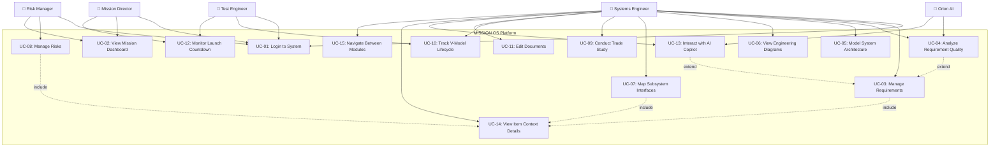

### Use Case Descriptions

| ID | Use Case | Primary Actor | Description |
|---|---|---|---|
| UC-01 | Login to System | All Users | Authenticate via codename and access code |
| UC-02 | View Mission Dashboard | Mission Director | Monitor telemetry, stats, mission health |
| UC-03 | Manage Requirements | Systems Engineer | View, analyze, and trace requirements |
| UC-04 | Analyze Requirement Quality | Orion AI | AI-driven verifiability and ambiguity scoring |
| UC-05 | Model System Architecture | Systems Engineer | Drag, zoom, pan subsystem topology |
| UC-06 | View Engineering Diagrams | Systems Engineer | Browse 6 diagram types (WBS, PERT, etc.) |
| UC-07 | Map Subsystem Interfaces | Systems Engineer | Interact with N² matrix cells |
| UC-08 | Manage Risks | Risk Manager | View heatmap, read risk register |
| UC-09 | Conduct Trade Study | Systems Engineer | Adjust weights, compare alternatives |
| UC-10 | Track V-Model Lifecycle | Test Engineer | Monitor phase progress, run gate checks |
| UC-11 | Edit Documents | Systems Engineer | Select and edit mission documents |
| UC-12 | Monitor Launch Countdown | Mission Director | Track countdown, simulate readiness |
| UC-13 | Interact with AI Copilot | Systems Engineer | Issue commands, receive analysis |
| UC-14 | View Item Context Details | All Users | Inspect selected item in context drawer |
| UC-15 | Navigate Between Modules | All Users | Use sidebar to switch views |

---

## 2. Class Diagram

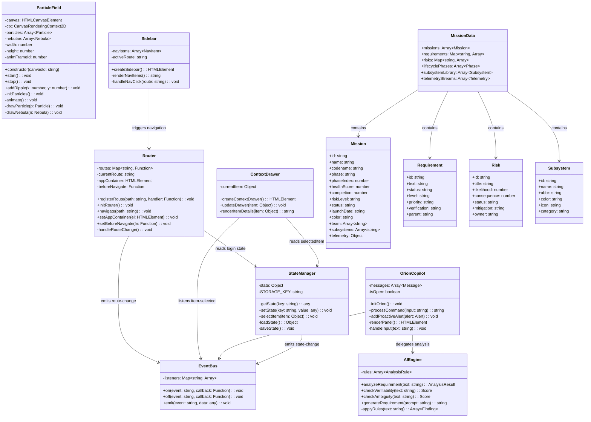

---

## 3. Sequence Diagrams

### 3.1 Login Sequence

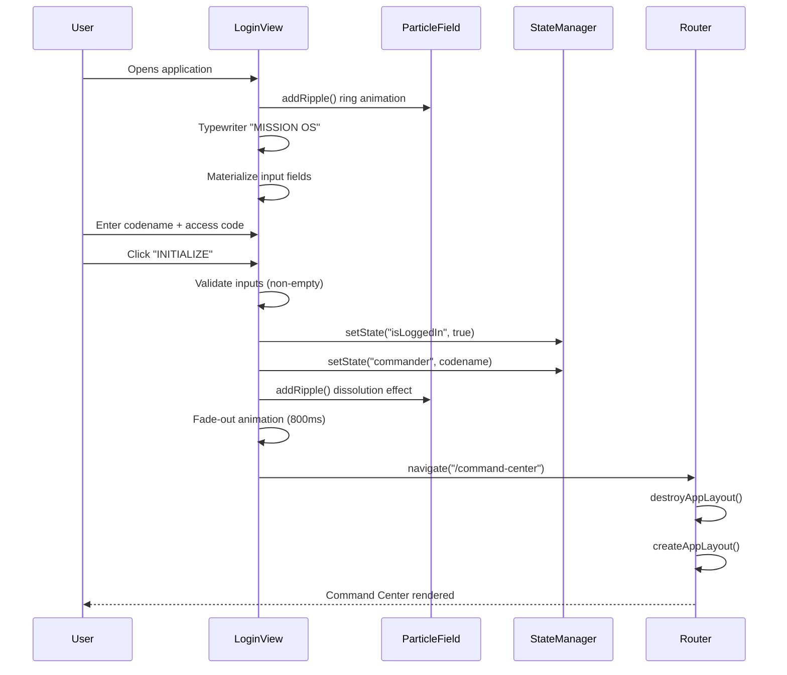

### 3.2 Requirements Analysis Sequence

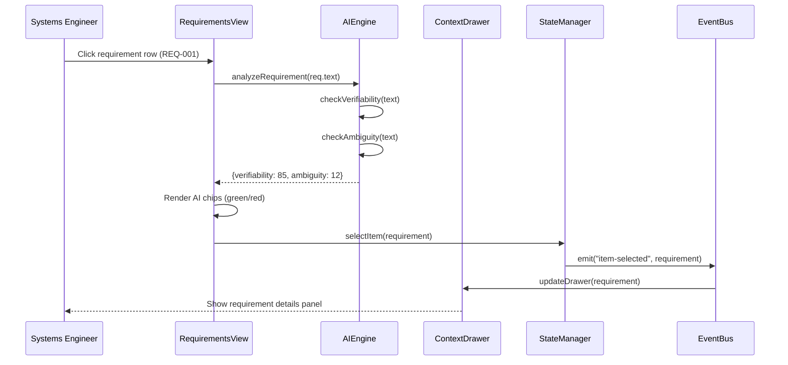

### 3.3 Trade Study Interaction Sequence

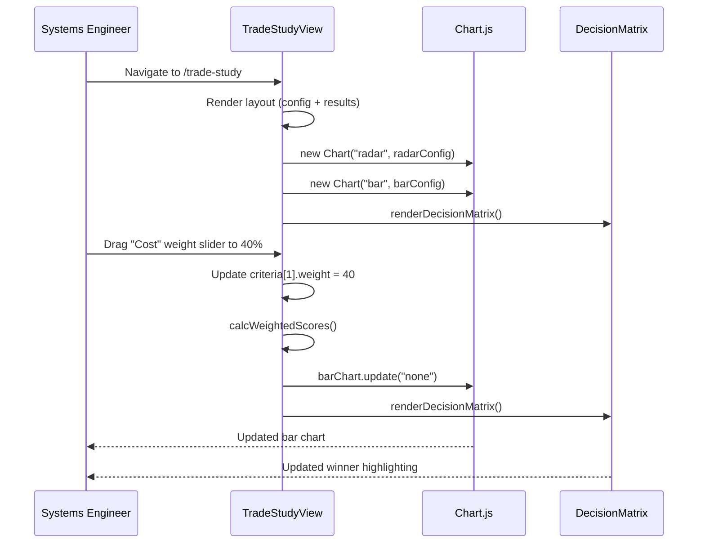

### 3.4 Navigation Sequence

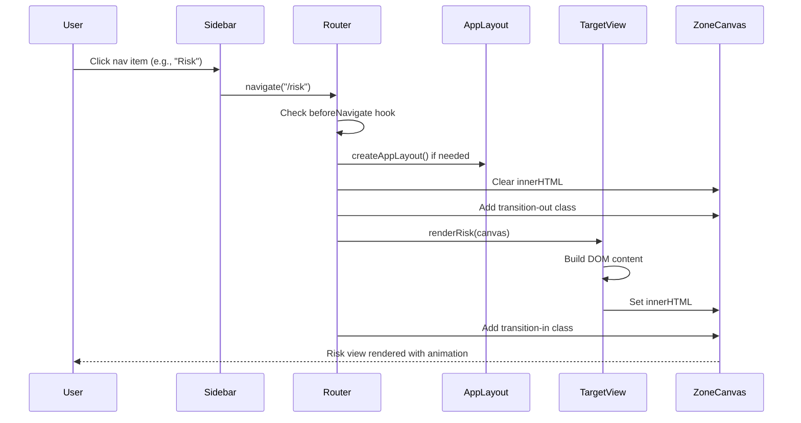

---

## 4. Activity Diagrams

### 4.1 Application Startup

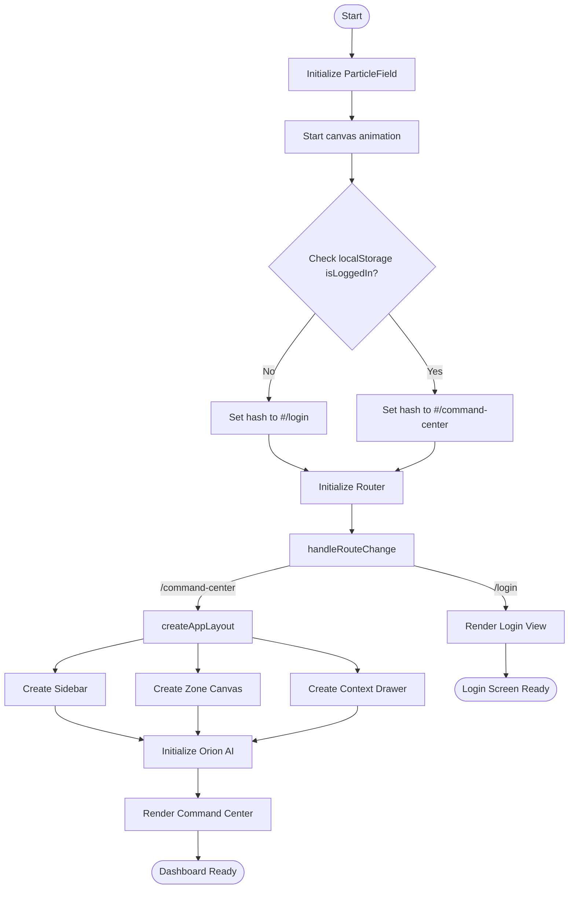

### 4.2 Requirement Quality Analysis

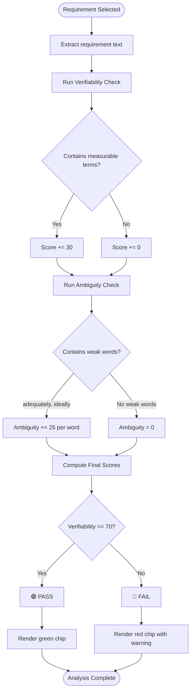

---

## 5. Component Diagram

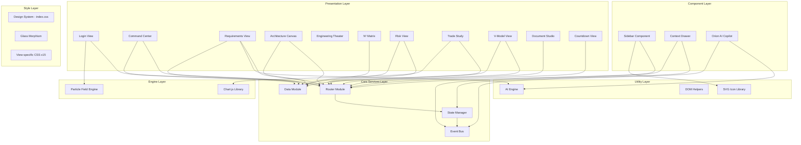

---

## 6. State Diagram — Application State Machine

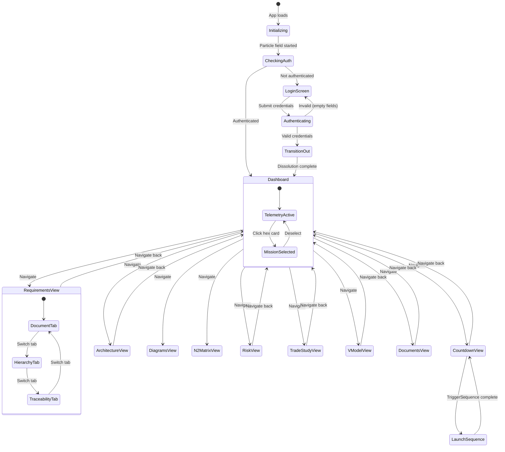

---

## 7. Deployment Diagram

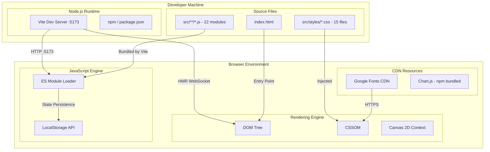
